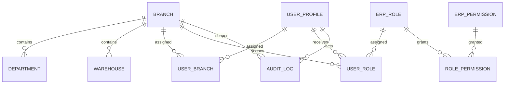

# Foundation ER diagram

```mermaid
erDiagram
  BRANCH ||--o{ DEPARTMENT : contains
  BRANCH ||--o{ WAREHOUSE : contains
  USER_PROFILE ||--o{ USER_BRANCH : assigned
  BRANCH ||--o{ USER_BRANCH : assigned
  USER_PROFILE ||--o{ USER_ROLE : receives
  ERP_ROLE ||--o{ USER_ROLE : assigned
  BRANCH ||--o{ USER_ROLE : scopes
  ERP_ROLE ||--o{ ROLE_PERMISSION : grants
  ERP_PERMISSION ||--o{ ROLE_PERMISSION : granted
  USER_PROFILE ||--o{ AUDIT_LOG : acts
  BRANCH ||--o{ AUDIT_LOG : scopes
```

`COMPANY_PROFILE` is a singleton row with `id = 1`; branch rows belong to that one company by system design.
